# Saé3.02 : MonsterHunt

Le monstre évolue dans un labyrinthe, une grille découpée en cases, avec lequel le chasseur interagit sans pour autant s’y situer.

Le monstre **connaît l’entrée** et **la sortie** et a une connaissance partielle ou totale des obstacles du labyrinthe.

Par défaut, un labyrinthe est une grille carrée avec des obstacles, **le monstre connaît l’emplacement des obstacles**, le chasseur découvre le labyrinthe au fur et à mesure.

Les **obstacles** occupent une case du labyrinthe qui **ne peut être traversée**. Il est possible de modifier le monstre dans les paramètres pour qu'il ait une connaissance limitée à quelques cases autours de lui et à la sortie.

Dans cette version des règles, l'IA du monstre ne pourra pas trouver un chemin à l’avance dans le labyrinthe mais devra y progresser à l’aveugle, en étant parfois obligé de rebrousser chemin. Le chasseur connaît la forme et la dimension de la grille, mais il ne connaît rien d’autre : ni l’emplacement de l’entrée ou de la sortie, ni l’emplacement des obstacles.

Le **but du jeu** pour le chasseur est de **trouver le monstre**, pour le monstre de **réussir à atteindre la sortie du labyrinthe** depuis l’entrée sans se faire attraper par le chasseur. Un tour de jeu consiste en **un coup du monstre suivi d’un coup du chasseur**, le chasseur jouant en premier.

---

## Démarrer l'application

Il faudra ouvrir un terminal, se déplacer dans le dossier application et entrer cette commande :

```bash
java --module-path ./javafx-sdk-11.0.2/lib/ --add-modules javafx.controls,javafx.fxml -jar MonsterHunt.jar
```

ou vous pouvez aussi la démarrer en cliquant sur le fichier launch.sh.

---
## Utilisations

Lorsque le jeu se lance vous atterissez sur le **menu principal**, depuis vous pouvez choisir le **nom des joueurs** pour chacun des **deux rôles** ainsi que de choisir si l'un des joueurs ou les deux joueurs soit/sont un/des **IA** avec leur **niveau de difficulté**. Pour jouer il suffit d'appuyer sur le bouton ***"PLAY"***, le jeu se lance alors, pour **sélectionner une case du labyrinthe** en passant la souris dessus et confirmer votre choix en appuyant **clic gauche** sur la case.

Le chasseur joue en premier. En tant que chasseur, sélectionner n'importe quel case la révèlera. Attention, cela révèle son état au moment du tir. Si le monstre passe sur cette case après que vous ayez tiré, vous ne le verrez pas à moins de retirer sur la case. Tirer sur une case où le monstre est passé indique le n° de tour quand est passé le monstre, mais vous serez notifié.
Vous gagnez si vous arrivez à tirer sur le monstre avant qu'il n'arrive à s'échapper.

En tant que monstre, vous devez sélectionner une case où vous pouvez jouer, c'est à dire une case à portée qui n'est pas un mur. Les cases accessible sont mises en valeur par rapport aux cases non-accessible quand vous passerez la souris dessus.

Essayez de retenir où a tiré le chasseur, car si vous passez sur une case où il a précédemment tiré, il sera avertis, lui donnant un précieux indice sur votre position.
Pour gagner, atteignez la sortie sans vous faire tirer dessus.

---
## Documentation

Vous pouvez retrouvez **toute la [documentation](doc/index.html)** (javadoc) en cliquant **[ici](doc/index.html)** ou sur documentation.

---
## Personnalisation de l'expérience de jeu

### Diffèrent mode de jeu :

Il existe **deux mode de jeu** dans ***MonsterHunt***, nous pouvons jouer en **écran partagé** ou en **écran scindé**.

Exemple de partie en **écran partagé** (sameScreen) : 

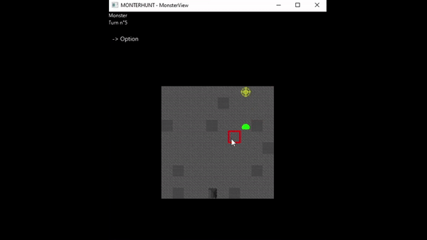

Exemple de partie en **écran scindé** (separateScreen) :

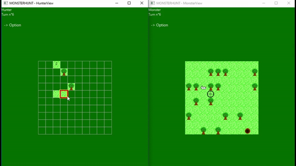


### Thèmes :

Nous avons conçu **diffèrent thèmes illustrés** pour le jeu, les voici :

- Donjon
- Cave
- Forêt
- Océan
- Prairie

Le **"mode image"** est activé par défaut au lancement, toute fois si les illustrations des thèmes ne vous conviennent pas il existe un **"mode couleur"** uniquement aux couleurs du thèmes.

**Thème Forêt** : 

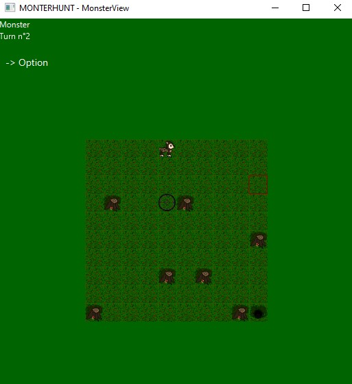

**Thème Océan** :

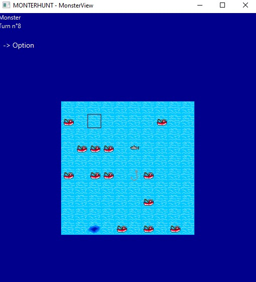

**Thème Donjon** :

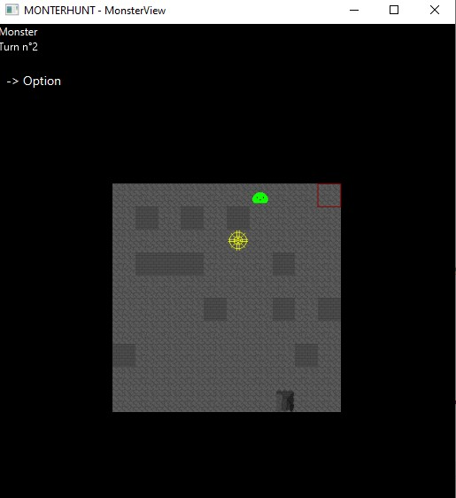

**Thème Cave** :

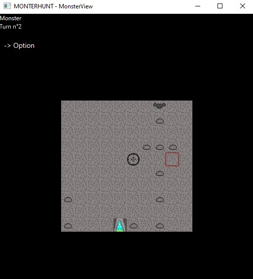

**Thème Prairie** :

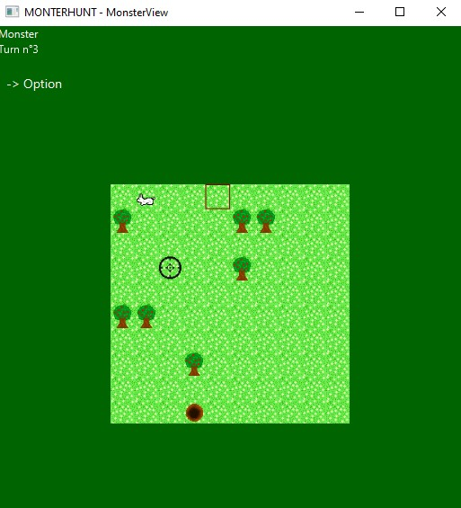


---
### Génération, Importation & Création de labyrinthe.

Nous avons ajouté la fonctionnalité de pouvoir **personnaliser la génération aléatoire du labyrinthe** avec les critères suivants :

- la hauteur du labyrinthe.
- la largeur du labyrinthe.
- le taux de génération de mur dans le labyrinthe.

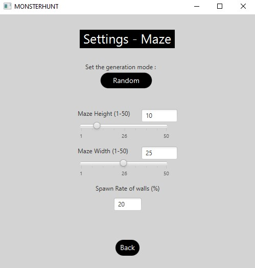

Cependant, nous proposons aussi au joueur de **jouer sur ses propres labyrinthes** grâce à l'option **Imported** qui permet d'importer des labyrinthe sous un **fichier .DAT** :

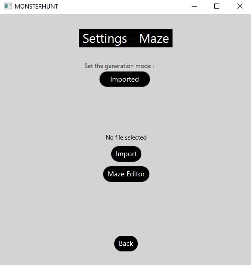

Enfin, nous proposons aussi au joueur de pouvoir **exprimer leur créativité** en présentant cet ***éditeur de labyrinthe*** qui vous permet de **créer de A à Z votre labyrinthe idéal et de le sauvegarder**, il permet aussi d'**éditer un labyrinthe déjà existant** grâce à l'importation.

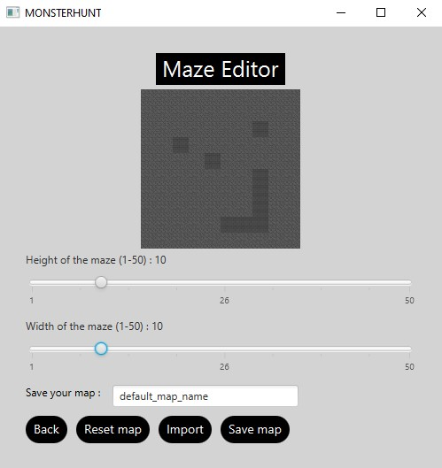

---
### Bonus du Monstre & du Chasseur.

Nous avons fait en sorte de pouvoir **personnaliser l'expérience de jeu du chasseur & du monstre** en ayant offrant la possibilité de leur octroyer des **bonus** à chacun. 

Du côté du Monstre, il est possible :

- **Augmenter sa portée de déplacement** (qui est par défaut de 1).
- **Activer la vision limité du labyrinthe** (brouillard) et si activé la portée de la vision.

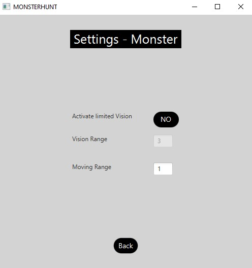

Du côté du Chasseur, il est possible :

- **Augmenter la portée de la vision** autour de la case sur laquelle il a tiré.

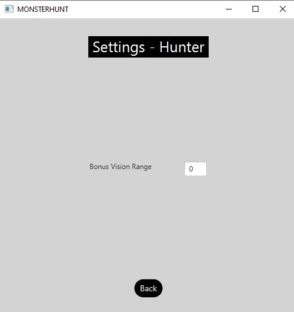


---
## Auteurs

Fourmaintraux Camille - camille.fourmaintraux.etu@univ-lille.fr  
Arthur Debacq - arthur.debacq.etu@univ-lille.fr  
Jessy Top - jessy.top.etu@univ-lille.fr  
Théo Franos - theo.franos.etu@univ-lille.fr  
